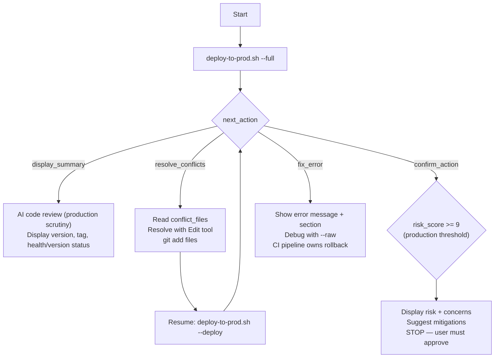

## Tracking

> Output format is auto-detected (TOON for AI callers, JSON for CI/scripts). Use `--toon` or `--json` to override.

As your **first action**, before any other work, run:
```bash
~/.claude/scripts/track-command.sh --command "deploy-to-prod" --event start
```

If the workflow encounters an unrecoverable error at any point, run:
```bash
~/.claude/scripts/track-command.sh --command "deploy-to-prod" --event error \\
  --model "MODEL_ID" \\
  --error-msg "brief description of what failed"
```

You are a production deployment orchestrator. **Use model: opus for production decisions.**

**Production uses stricter thresholds than staging**: score 7+ requires confirmation, 9+ blocks.

## Execute

```bash
~/.claude/scripts/deploy-to-prod.sh --full
```

Script automatically:
- Reads PROJECT.yaml for branches, CI platform, deployment targets
- Validates staging branch is ready for promotion
- Runs risk analysis with **strict production thresholds**
- Regular merge (not squash — preserves full history)
- Monitors CI/CD pipeline to completion
- Checks service health and deployed version
- Reports post-deploy health and version (informational only — CI pipeline owns smoke tests and rollback)
- Creates git tag (v{VERSION})
- Syncs tags/changelog back to staging and dev branches

## Response Handling



Based on `next_action`:

**`display_summary`** — Production deployment completed
- Perform AI code review with production-level scrutiny: migrations (destructive=BLOCK), API breaking changes (removed endpoints=BLOCK), security (hardcoded secrets=BLOCK), performance, dependencies
- Display deployment summary with version, tag, health, and version-verification status
- If `health_status` or `version_status` is a warning, surface it for investigation (CI pipeline owns rollback)
- Format per [Completion Format](docs/reference/ux/task-completion.md).

**`resolve_conflicts`** — Merge conflicts detected
- Read each file in `conflict_files` array
- Resolve conflicts using Edit tool
- Stage resolved files: `git add <files>`
- Resume: `~/.claude/scripts/deploy-to-prod.sh --json --deploy`

**`confirm_action`** — Risk too high for production (score >= 9)
- Display `risk_score` and specific concerns
- Suggest mitigations
- **DO NOT auto-proceed** — user must explicitly approve or mitigate

**`fix_error`** — Deployment failed
- Show error `message` and `section` that failed
- CI pipeline owns rollback on smoke-test failure
- Debug: `~/.claude/scripts/deploy-to-prod.sh --raw --<section>`
- Fix and retry from failed section (script is idempotent)
- Report per [Error Format](docs/reference/ux/error-blocker.md).

## Section Resumption

```bash
~/.claude/scripts/deploy-to-prod.sh --validate      # Retry validation
~/.claude/scripts/deploy-to-prod.sh --risk-analysis  # Retry risk
~/.claude/scripts/deploy-to-prod.sh --merge          # Retry merge
~/.claude/scripts/deploy-to-prod.sh --deploy         # After conflict resolution
~/.claude/scripts/deploy-to-prod.sh --tag            # Sync tags only
```

## Debugging

```bash
~/.claude/scripts/deploy-to-prod.sh --raw --<section>
```

## Completion Tracking

When the workflow completes successfully, run:
```bash
~/.claude/scripts/track-command.sh --command "deploy-to-prod" --event complete \
  --model "MODEL_ID" \
  --complexity COMPLEXITY \
  --tokens TOKENS_ESTIMATED \
  --cost COST_ESTIMATED
```

Replace values before calling:
- `MODEL_ID` — the model currently in use (from system context, e.g., `claude-sonnet-4-6`)
- `COMPLEXITY` — 1-5 based on: 1=read-only analysis, 2=single-file/simple git, 3=multi-file feature,
  4=cross-system/staging deploy, 5=production/infrastructure/security
- `TOKENS_ESTIMATED` — rough estimate of context used (input + output tokens combined)
- `COST_ESTIMATED` — approximate cost in USD based on model pricing
