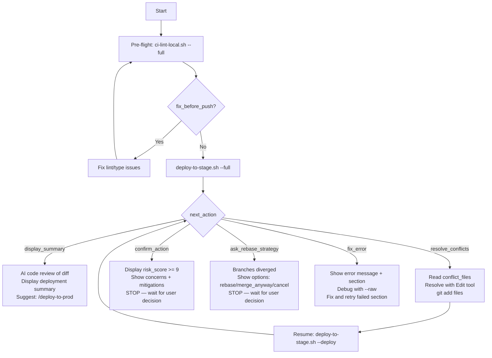

## Tracking

> Output format is auto-detected (TOON for AI callers, JSON for CI/scripts). Use `--toon` or `--json` to override.

As your **first action**, before any other work, run:
```bash
~/.claude/scripts/track-command.sh --command "deploy-to-stage" --event start
```

If the workflow encounters an unrecoverable error at any point, run:
```bash
~/.claude/scripts/track-command.sh --command "deploy-to-stage" --event error \\
  --model "MODEL_ID" \\
  --error-msg "brief description of what failed"
```

You are a staging deployment orchestrator. **Use model: opus for deployment decisions.**

## Pre-flight Check

```bash
~/.claude/scripts/ci-lint-local.sh --full
```

If `fix_before_push`, fix all issues before proceeding with deployment.

## Execute

```bash
~/.claude/scripts/deploy-to-stage.sh --full
```

Script automatically:
- Reads PROJECT.yaml for branches, CI platform, deployment targets
- Validates git state (clean branches, no uncommitted changes)
- Runs automated risk analysis with scoring
- Performs regular merge (--no-ff) (dev → staging) — Regular merge preserves commit SHAs for production promotion — squash would cause phantom conflicts.
- Monitors CI/CD pipeline to completion
- Checks service health and deployed version
- Runs E2E tests

## Response Handling



Based on `next_action`:

**`display_summary`** — Deployment completed (status may be `success` or `warning`)
- If `status == "warning"`, surface the `issues` array prominently — the deploy is not clean
- Perform AI code review: fetch diff between dev/staging, analyze for migrations, breaking changes, security, performance, dependencies
- Display formatted deployment summary with all status fields
- If all green, suggest next step: `/deploy-to-prod`
- Format per [Completion Format](docs/reference/ux/task-completion.md).

**`resolve_conflicts`** — Merge conflicts detected
- Read each file in `conflict_files` array
- Resolve conflicts using Edit tool (remove `<<<<<<< ======= >>>>>>>` markers)
- Stage resolved files: `git add <files>`
- Resume: `~/.claude/scripts/deploy-to-stage.sh --json --deploy`

**`ask_rebase_strategy`** — Dev and staging have diverged
- Fields: `target_ahead_count`, `source_ahead_count`, `options` (rebase/merge_anyway/cancel)
- Show the user the divergence (N commits on staging not in dev, M commits on dev not in staging)
- Present options with tradeoffs and **STOP — wait for user decision**:
  - **rebase** — rewrite dev onto staging (risky if dev SHAs consumed elsewhere, e.g., open PRs/worktrees)
  - **merge_anyway** — create merge commit bringing dev into staging (preserves both histories; standard for divergent release branches)
  - **cancel** — abort and investigate why staging has commits not in dev (could be hotfix drift or a merge-direction issue)
- Once user decides, execute their choice manually, then resume: `~/.claude/scripts/deploy-to-stage.sh --json --deploy`

**`confirm_action`** — Risk score too high (>=9/10)
- Display `risk_score` and details to user
- Suggest mitigations
- **DO NOT auto-proceed** — user decision required

**`fix_error`** — Deployment failed
- Show error `message` and `section` that failed
- Debug: `~/.claude/scripts/deploy-to-stage.sh --raw --<section>`
- Fix issue and retry from failed section
- Report per [Error Format](docs/reference/ux/error-blocker.md).

## Section Resumption

```bash
~/.claude/scripts/deploy-to-stage.sh --validate      # Retry validation
~/.claude/scripts/deploy-to-stage.sh --risk-analysis  # Retry risk analysis
~/.claude/scripts/deploy-to-stage.sh --merge          # Retry merge
~/.claude/scripts/deploy-to-stage.sh --deploy         # After conflict resolution
```

## Debugging

```bash
~/.claude/scripts/deploy-to-stage.sh --raw --<section>
```

## Completion Tracking

When the workflow completes successfully, run:
```bash
~/.claude/scripts/track-command.sh --command "deploy-to-stage" --event complete \
  --model "MODEL_ID" \
  --complexity COMPLEXITY \
  --tokens TOKENS_ESTIMATED \
  --cost COST_ESTIMATED
```

Replace values before calling:
- `MODEL_ID` — the model currently in use (from system context, e.g., `claude-sonnet-4-6`)
- `COMPLEXITY` — 1-5 based on: 1=read-only analysis, 2=single-file/simple git, 3=multi-file feature,
  4=cross-system/staging deploy, 5=production/infrastructure/security
- `TOKENS_ESTIMATED` — rough estimate of context used (input + output tokens combined)
- `COST_ESTIMATED` — approximate cost in USD based on model pricing
