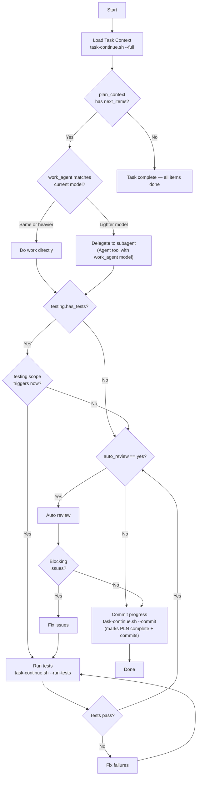

## Tracking

> Output format is auto-detected (TOON for AI callers, JSON for CI/scripts). Use `--toon` or `--json` to override.

As your **first action**, before any other work, run:
```bash
~/.claude/scripts/track-command.sh --command "task-continue" --event start
```

If the workflow encounters an unrecoverable error at any point, run:
```bash
~/.claude/scripts/track-command.sh --command "task-continue" --event error \
  --model "MODEL_ID" \
  --error-msg "brief description of what failed"
```

You are a task continuation assistant. Your job is to **read the plan, figure out what's next, do the work, and commit progress**.



**Validate-before-record ordering**: Tests and review run BEFORE the PLN is marked complete. The `task-continue.sh --commit` call at Step 5 updates the PLN and commits in one atomic operation — do NOT call `plan-progress.sh --mark-complete` separately before tests pass. A subtask is only recorded as "done" once it has passed validation.

## Step 1: Load Task Context

```bash
~/.claude/scripts/task-continue.sh --full --task-id TASK_ID
```

Returns: `task_id`, `task_title`, `task_doc`, `task_type`, `branch`, `plan_doc`, `work_agent`, `test_agent`, `review_type`, `fresh_context`, `auto_review`, `tdd_required`, `testing`, `plan_context`

## Step 2: Determine Next Work

From `plan_context`: check `next_items` for unchecked items. Only read the full PLN if you need details beyond what `plan_context` provides.

## Step 2b: TDD Enforcement (When Required)

**CRITICAL — TDD enforcement is NON-NEGOTIABLE when `tdd_required == "yes"`:**
- The commit script WILL block production files without tests — this is by design
- You MUST NOT bypass it by running `git add` + `git commit` directly
- You MUST NOT work around it with `--skip-tdd-check` or any other flag
- If the script blocks, the ONLY correct response is to write the tests

If `tdd_required == "yes"` (from Step 1 response or `next_task_config`):
1. **Before writing ANY production code**, write a failing test that covers the subtask's acceptance criteria
2. Run the test to confirm it fails (red phase)
3. Implement the production code to make the test pass (green phase)
4. Commit both test and production files together via `--commit`

If `tdd_required == "recommend"`: write tests first when practical; commit script will warn but not block.
If `tdd_required == "no"` or missing: proceed directly to Step 3.

**When delegating to a subagent**: If the subtask has `tdd_required: yes`, the subagent prompt MUST include the instruction to write tests first. Include the test file paths and patterns from the project.

## Step 3: Do the Work

### Why subagents matter

Subagents are not just about cost — they protect the parent conversation from **context pollution**. A subtask that reads 10 files, writes 5, runs tests, and fixes failures consumes thousands of tokens of intermediate state. If that happens in the parent context, the next subtask starts with all that noise still loaded — leading to worse decisions, slower responses, and earlier compaction.

**Use a subagent when:**
- `fresh_context == "yes"` in the PLN (explicit signal — always honor this)
- `work_agent` is a lighter model than the current model (cost savings)
- The subtask is M complexity or higher and involves reading/writing multiple files (context isolation)
- Multiple independent subtasks can run in parallel (throughput)

**Do the work directly (no subagent) when:**
- The subtask is XS/S and will be done in under 5 minutes
- You need to ask the user a question mid-task (subagents can't interact with the user)
- The subtask requires context from the immediately-preceding subtask (e.g., "use the pattern you just established")

**Default: prefer subagents for M+ complexity.** The overhead of dispatching (~10s, ~500 tokens for the prompt) is almost always cheaper than polluting the parent with thousands of tokens of file reads and intermediate state.

### Dispatch rules

| Condition | Action |
|---|---|
| `fresh_context == "yes"` | **Always** dispatch to subagent with `isolation: "worktree"` |
| `work_agent` is lighter model | **Always** dispatch to subagent with `model` set to `work_agent` |
| M+ complexity, multi-file | **Prefer** subagent (same model, no isolation) for context protection |
| XS/S, single file, quick | Do directly — subagent overhead exceeds the work |
| Multiple independent next items | Dispatch in **parallel** via multiple Agent calls in one message |

### Subagent prompt template

Every subagent prompt MUST be self-contained — the subagent has zero context from this conversation. Include:

```
You are implementing subtask "{task_label}" from PLN {task_id}.

## What to do
{subtask description from PLN — copy the full Description field}

## Files to modify
{files list from PLN}

## Acceptance criteria
{[AC#] tags and their descriptions from PLN}

## Constraints
- Tech stack: {from PROJECT.yaml if present}
- TDD required: {yes/no — if yes, write failing test FIRST}
- Do NOT commit — leave files staged. The parent will commit.
- Do NOT read files beyond what's listed unless you discover a dependency.

## When done, report
Respond with EXACTLY this structure:
- **Status**: pass | fail
- **Files changed**: list of files you created or modified
- **Tests**: list of test files written (if TDD)
- **Issues**: any problems encountered
- **Time estimate**: how long this would take a human (for calibration)
- **Lessons**: anything surprising or non-obvious (if any)
```

**Why this structure matters**: The parent needs `Status` to decide whether to proceed to review/commit. `Files changed` tells it what to stage. `Lessons` feeds into the `--lessons` flag on commit. Without this structure, the parent has to parse free-form text and guess.

### Parallel dispatch

When `plan_context.next_items` contains 2+ subtasks with no dependencies between them (check the Dependencies field in the PLN), dispatch them simultaneously:

```
# In a single message, send multiple Agent calls:
Agent({ prompt: "subtask 1.1 ...", model: "sonnet" })
Agent({ prompt: "subtask 1.2 ...", model: "sonnet" })
```

Both run concurrently. When both return, review results, run tests, and commit together. This is the single biggest throughput win for L/XL tasks with independent subtasks.

### After the work

Announce per [Progress Format](docs/reference/ux/progress-update.md). **Do NOT call `plan-progress.sh --mark-complete` here** — that happens atomically inside Step 5's `--commit` call, AFTER tests and review pass. Marking a task complete before it has been validated would put the PLN in a lying state.

**Capture reflection fields as you go** so you can pass them to the Step 5 commit:
- `--actual-time` (required): honest estimate of time spent, format like `15m`, `30m`, `1h`, `1.5h`, `2h`. If a 30m task took 1.5h, report 1.5h — this calibrates future estimates.
- `--task-label` (required): `"Task X.Y"` identifier from the PLN
- `--lessons` (when noteworthy): surprising or non-obvious insights
- `--went-well` / `--challenges` / `--differently` / `--patterns` (when noteworthy)
- Skip reflection fields only for trivial tasks (XS complexity, <5 minutes).

## Step 4: Run Focused Tests (When Applicable)

```bash
~/.claude/scripts/task-continue.sh --run-tests --task-id TASK_ID
```

**CRITICAL — Test execution goes through Makefile targets, never directly.** See [Testing Best Practices](~/.claude/docs/reference/testing.md).

The script automatically:
1. Runs `make test` (structured JSON output — auto-detected for AI callers)
2. Parses the JSON for `passed`, `failed`, `failures[]`, and per-`services` breakdown
3. Returns structured failure data so the LLM can drill into the narrowest failing target
4. Lists `available_targets` (e.g., `test,test-unit-backend,test-unit-frontend`) for targeted re-runs

**Progressive testing** — only run what's relevant:
- `testing.has_tests = false` → skip entirely
- `testing.scope = "task"` → run after implementation tasks only
- `testing.scope = "phase"` → run after last task in a phase
- `testing.scope = "full"` → run after all phases complete

**When tests fail**, the response includes:
- `failures[]` — array of `{service, test, reason}` from the JSON output
- `services` — per-service pass/fail breakdown
- `available_targets` — Make targets available for narrower re-runs

**Drill-down pattern** (saves tokens — run the narrowest target that covers the failure):
```bash
make test                                # Full suite fails → check services
make test-unit-backend                   # Backend fails → check specific suite
make test-unit-backend SUITE=incidents   # Run specific suite
```

If tests fail, report per [Error Format](docs/reference/ux/error-blocker.md), fix the issues, then re-run.
Delegate fixes to the `test_agent` model via the Agent tool if appropriate.

## Step 4b: Auto Review (When Enabled)

If `auto_review == "yes"` (from Step 1 response), run a review after tests pass:

**Context for the review subagent** — always include in the prompt:
1. The subtask description from `plan_context.next_items[0]` (what was supposed to be done)
2. The diff: `git diff HEAD~1` (what was actually changed)
3. If `PROJECT.yaml` exists, mention the tech stack so the reviewer checks project-specific patterns

**Review dispatch** based on `review_type`:
- **`single`**: One Agent call — review for spec compliance, security, performance, and patterns. The prompt must say: "If blocking issues found, list each as `BLOCKING: file:line — description`. If none, say APPROVED."
- **`two-stage`**: Two sequential Agent calls:
  1. **Spec compliance**: "Does the implementation match the subtask requirements? Flag gaps or deviations."
  2. **Code quality**: "Check for security issues, performance problems, error handling gaps, and pattern violations."

**Review subagent output contract**: The reviewer MUST end with one of:
- `APPROVED` — no blocking issues found
- `BLOCKING: file:line — description` (one per line) — issues that must be fixed

Do NOT treat exploratory analysis prefixed with `BLOCKING:` as actual blockers. Only lines that end with a concrete issue description are blockers. If the reviewer writes `BLOCKING:` as a heading and then walks it back, that's APPROVED.

If review contains real `BLOCKING:` issues, fix them, then **go back to Step 4 and re-run tests** (review fixes are code changes — they need re-validation). Only proceed to Step 5 once tests are green AND review is clean. Non-blocking suggestions can be noted in `--lessons`.

## Step 5: Commit Progress

```bash
~/.claude/scripts/task-continue.sh --commit --task-id TASK_ID \
  --progress-note "What was accomplished in this session" \
  --completed-tasks "1.1,1.2" \
  --lessons "Notable insight from this work" \
  --went-well "What worked well" \
  --challenges "Difficulties encountered" \
  --differently "What to change next time" \
  --patterns "Reusable patterns discovered"
```

**ALWAYS use `task-continue.sh --commit`** — NEVER bypass it with direct `git add` + `git commit`. The script enforces TDD compliance, updates the PLN, and maintains document indexes. If the script blocks your commit, fix the reason it blocked (write tests, resolve conflicts, etc.) — do NOT work around it.

Format the commit plan per [Commit Confirmation](docs/reference/ux/commit-confirmation.md). Automatically updates PLN document (marks tasks complete, appends progress entry with lessons/reflections), stages files, commits, and updates document index. Announce completion per [Completion Format](docs/reference/ux/task-completion.md).

Pass `--lessons` when you encountered a surprising gotcha, useful pattern, or process improvement. Pass `--went-well`, `--challenges`, `--differently`, `--patterns` when noteworthy — these are optional, skip if the session was routine.

## Key Principles

- **The plan drives the work** — read the PLN to know what's next
- **Subagents are the default for M+ work** — dispatch to a subagent for context isolation and cost savings. Only do XS/S work directly. The parent conversation is for orchestration, not implementation.
- **TDD is non-negotiable** — when `tdd_required: yes`, write tests FIRST. Never bypass the commit script with manual git commands.
- **Always commit through the script** — `task-continue.sh --commit` enforces TDD, updates the PLN, and maintains indexes. Direct `git commit` is forbidden during task execution.
- **Parallel when independent** — if next_items have no dependency between them, dispatch simultaneously
- **Progressive testing** — task → phase → full suite, never run everything every time

## Completion Tracking

When the workflow completes successfully, run:
```bash
~/.claude/scripts/track-command.sh --command "task-continue" --event complete \
  --model "MODEL_ID" \
  --complexity COMPLEXITY \
  --tokens TOKENS_ESTIMATED \
  --cost COST_ESTIMATED
```

Replace values before calling:
- `MODEL_ID` — the model currently in use (from system context, e.g., `claude-sonnet-4-6`)
- `COMPLEXITY` — 1-5 based on: 1=read-only analysis, 2=single-file/simple git, 3=multi-file feature,
  4=cross-system/staging deploy, 5=production/infrastructure/security
- `TOKENS_ESTIMATED` — rough estimate of context used (input + output tokens combined)
- `COST_ESTIMATED` — approximate cost in USD based on model pricing
